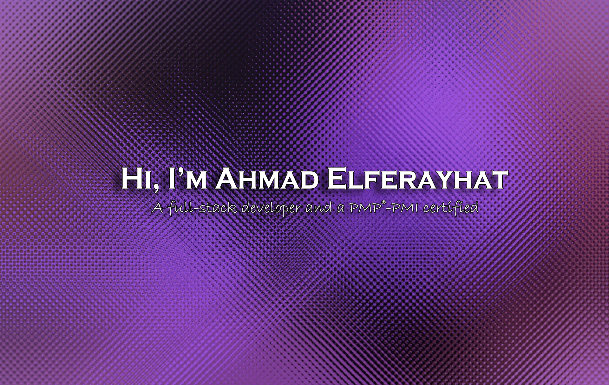

---

## 👋 &nbsp;Hi there

I'm a beginner full-stack developer based in Jordan with a passion for coding and problem-solving. I’m currently exploring the exciting world of web development, building projects that improve my skills and create real-world value, I love combining creativity with logic, whether it's designing intuitive user interfaces or writing clean and efficient backend code.
Outside of coding, I’m passionate about sports—both watching and playing—and I enjoy staying active through soccer and fitness. I also love working on creative side projects and sharing my learning journey.
Let’s connect and collaborate! 🚀

---

## 🧰 &nbsp;My toolbox

 &nbsp; &nbsp; &nbsp;  &nbsp; &nbsp;  &nbsp;
 &nbsp; &nbsp; &nbsp; &nbsp;

&nbsp;

---

## 📊 &nbsp;Stats

---

## 🤙 Connect with me

